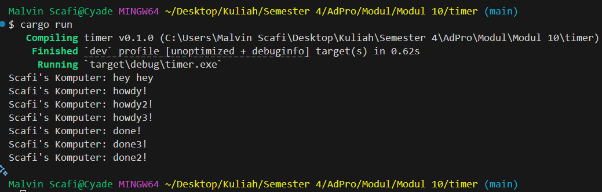
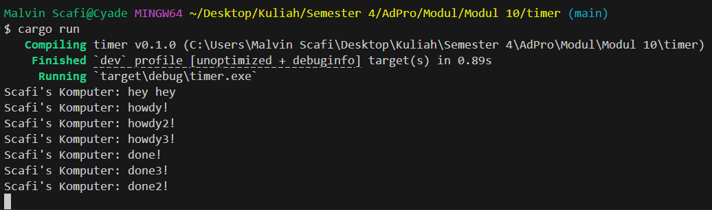

# Tutorial 10
**Nama:**   Malvin Scafi<br>
**NPM:**    2306275746<br>
**Kelas:**  Pengjut A<br>

## Modul 10
### Experiment 1.2


- Pada gambar bisa dilihat bahwa pesan "hey hey" keluar terlebih dahulu sebelum "howdy!" dan "done!" ini dikarenakan ada `println!()` yang dijalankan sebelum fungsi async

```rust
    println!("Scafi's Komputer: hey hey");

    // Drop the spawner so that our executor knows it is finished and won't
    // receive more incoming tasks to run.
    drop(spawner);

    // Run the executor until the task queue is empty.
    // This will print "howdy!", pause, and then print "done!".
    executor.run();
```
Bisa dilihat dari code bahwa perintah `println()` ditaruh sebelum `executor.run()` yang menyebabkan perintah `println()` akan keluar terlebih dahulu secara sinkronus baru akan dijalankan fungsi async

### Experiment 1.3
#### Multiple Spawn

```rust
    spawner.spawn(async {
        println!("Scafi's Komputer: howdy2!");
        // Wait for our timer future to complete after two seconds.
        TimerFuture::new(Duration::new(2, 0)).await;
        println!("Scafi's Komputer: done2!");
    });
    spawner.spawn(async {
        println!("Scafi's Komputer: howdy3!");
        // Wait for our timer future to complete after two seconds.
        TimerFuture::new(Duration::new(2, 0)).await;
        println!("Scafi's Komputer: done3!");
    });
```
- Pada eksperimen ini, beberapa task dibuat menggunakan `spawner.spawn`, di mana setiap task menjalankan proses asinkronus. Setiap task dimulai dengan mencetak pesan awal, kemudian menunggu selama dua detik menggunakan `TimerFuture::new(Duration::new(2, 0)).await.` Setelah waktu tunggu selesai, task melanjutkan eksekusi dan mencetak pesan akhir. Karena sifat asinkronus dari task-task ini, mereka dapat berjalan secara bersamaan, sehingga pesan-pesan yang dihasilkan tidak muncul secara berurutan, melainkan bersamaan.

#### Multiple Spawn No Drop

```rust
    // Drop the spawner so that our executor knows it is finished and won't
    // receive more incoming tasks to run.
    // drop(spawner);
```
- Pada eksperimen ini, perintah `drop(spawner)` dihilangkan, sehingga program terus berjalan tanpa henti. Hal ini disebabkan oleh executor yang terus melakukan looping sambil menunggu spawner menambahkan task baru ke dalam queue. Karena `drop()` tidak dipanggil, executor tidak mendapatkan sinyal bahwa tidak ada lagi task yang akan ditambahkan, sehingga program masuk ke dalam loop tak berujung.