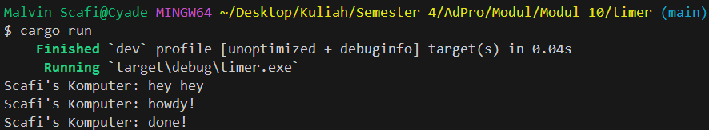

# Tutorial 10
**Nama:**   Malvin Scafi<br>
**NPM:**    2306275746<br>
**Kelas:**  Pengjut A<br>

## Modul 10
### Experiment 1.1


- Pada gambar bisa dilihat bahwa pesan "hey hey" keluar terlebih dahulu sebelum "howdy!" dan "done!" ini dikarenakan ada `println!()` yang dijalankan sebelum fungsi async

```rust
    println!("Scafi's Komputer: hey hey");

    // Drop the spawner so that our executor knows it is finished and won't
    // receive more incoming tasks to run.
    drop(spawner);

    // Run the executor until the task queue is empty.
    // This will print "howdy!", pause, and then print "done!".
    executor.run();
```
Bisa dilihat dari code bahwa perintah `println()` ditaruh sebelum `executor.run()` yang menyebabkan perintah `println()` akan keluar terlebih dahulu secara sinkronus baru akan dijalankan fungsi async